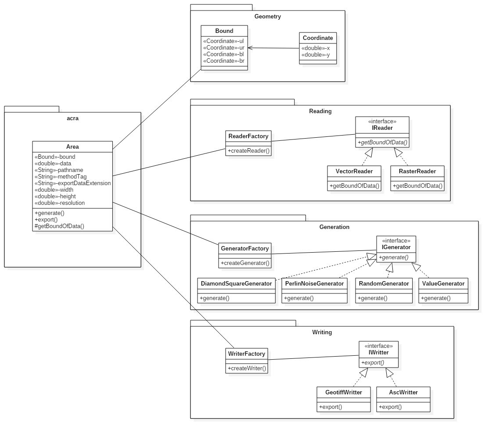

# TSI 2017, Projet personnel 2
## Sujet n°3 : API de génération de terrain aléatoire
## Antoine Moutou

### Sujet :
La génération de terrain aléatoire consiste à simuler un MNT, par exemple afin d’offrir aux joueurs
d’un jeu vidéo, une expérience différente à chaque partie.
L’objectif du projet est d’implémenter au moins un algorithme de génération de terrain aléatoire.
Objectifs :

+ Génération d’un MNT aléatoire
+ Différents algorithmes : aléatoire pur, Diamond Square, etc.
+ Chargement d’une couche de données géographiques pour définir l’emprise du MNT
+ Export du MNT : ASC et géotiff.

### Conduite du projet
#### Analyse et conception
Pour commencer ce projet j'ai d'abord pris le temps de regarder les différents algorithmes de génération de terrain qui existait déjà pour pouvoir les intégrer plus facilement dans ma future architecture ... Je me suis ensuite entièrement consacré à l'analyse du projet au travers de l'élaboration d'un diagramme de classe respectant et applicant les concepts vu en cours ces dernières semaines (Programmation Orienté Objet, Design Patterns, ...). Finalement, une fois l'architecture fixée je me suis intéréssé aux différentes libraries pour manipuler des fichiers géographiques. Je reviendrai plus en détails sur ces différents [choix techniques](#choix-techniques) dans la section dédiée.

#### Test Driven Development
L'une des étapes du projet était l'application de la méthode de développement TDD. Cette approche, à laquelle nous n'étions pas familiarisé, m'a quelque peu ralenti au début du développement. Toutefois j'ai réussi à la conserver pour le développement des différentes classes ormis les algorithme de génération à proprement parler. Pour ces derniers je pense que les tests pourraient être consolidés car je n'ai pas eu le temps de tester tout les cas "extrèmes". 

### Choix techniques
#### Lecture/écriture de fichier géographiques
Pour ce qui est de la manipulation des données géographiques deux choix s'offraient à moi : GDAL et GeoTools. Après discussion avec mes camarades et une lecture plus approfondie des documentations respectives mon choix c'est porté sur GeoTools car j'ai déjà réalisé un travail avec GDAL dernièrement et que j'ai trouvé intéressant d'utiliser une autre librairie ayant des fonctionnalités équivalentes.

#### Algorithmes de génération de terrain
Les trois algorithmes que j'ai choisi de reprendre sont : 
+ Le bruit de Perlin
+ L'algorithme diamant-carré
+ L'aléatoire 

#### Encapsulation pour l'utilisateur
Le diagramme de classes présenté dans la section ["Modélisation UML"](#modelisation-uml) a été réalisé dans le but de faciliter son utilisation. Ainsi un utilisateur de l'API n'a besoin que d'une seule classe et de 4 méthodes pour génerer et exporter autant de MNT qu'il le souhaite.

### Modélisation UML

La classe principale de notre API est Area. Autour de cette classe s'articulent les différentes interfaces qui permettent la lecture et l'écriture de fichiers ainsi que la généraion de MNT.

#### Design patterns utilisés
+ Factory, pour faciliter l'ajout des classes implémentant les différentes interfaces (de lecture, de génération et d'export.
+ Strategy, pour permettre une permutation dynamique des différent algorithme de lecture, génération et d'export.

### Résultats obtenus :
Ci-dessous les résultats obtenus pour les 3 méthodes de génération 

Algorithme diamant-carré :

Bruit de Perlin :

Aléatoire : 

